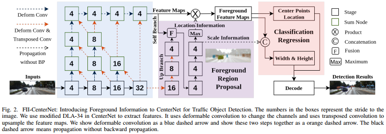
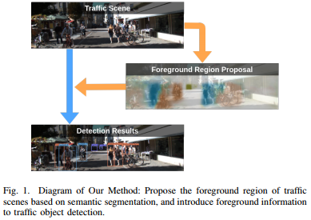
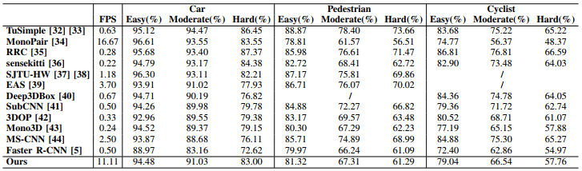
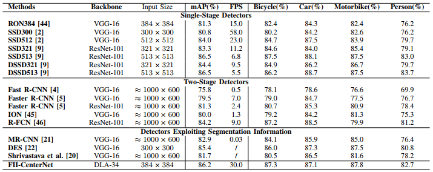
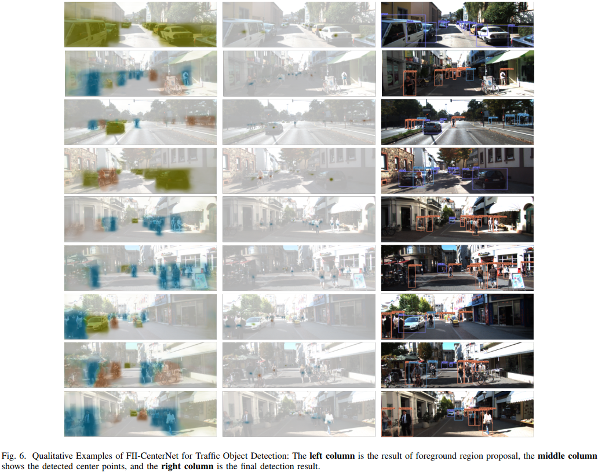

# FII-CenterNet: An Anchor-free Detector with Foreground Attention for Traffic Object Detection



### (0) Abstract
Most successful object detectors are anchor-based, which is difficult to adapt to the diversity of traffic objects. We propose a novel anchor-free method, called FIICenterNet. It introduces the foreground information to CenterNet to eliminate the interference of complex background information in traffic scenes. The foreground region proposal network is based on semantic segmentation. Midground is introduced as the transition between foreground and background. In addition to foreground location information, scale information is introduced to improve the regression results.




### (1) Setup
This code has been tested with Python 3.6, PyTorch v0.4.1, CUDA 9.0 and cuDNN v7 on Ubuntu 16.04.
* Setup python environment
  ```
  conda create -n FIICenterNet python=3.6
  source activate FIICenterNet
  ```
* Install pytorch0.4.1
  ```
  conda install pytorch=0.4.1 torchvision -c pytorch
  ```
* Install COCOAPI
  ```
  # COCOAPI=/path/to/clone/cocoapi
  git clone https://github.com/cocodataset/cocoapi.git $COCOAPI
  cd $COCOAPI/PythonAPI
  make
  python setup.py install --user
  ```
* Clone the repository
* Install the requirements
  ```
  pip install -r requirements.txt
  ```
* Compile deformable convolutional (from DCNv2)
  ```
  cd $FIICenterNet_ROOT/src/lib/models/networks/DCNv2
  ./make.sh
  ```
* [**Optional**] Compile NMS if your want to use multi-scale testing or test ExtremeNe.
  ```
  cd $FIICenterNet_ROOT/src/lib/external
  make
  ```
* Download pertained models

  | Dataset                  | Pretrained Model  |  Results  | 
  |--------------------------|----------------|------------|
  | KITTI                    | [Baidu](https://pan.baidu.com/s/1IGcg4YLN_nLxZNHLVHyOyg): 3xdh | [Baidu](https://pan.baidu.com/s/1jZ5ct4zgKZ7thDV5XbLOjw): sb67 |
  | Pascal VOC               | [Baidu](https://pan.baidu.com/s/1pWldlPXlugVCIKaMKF6zJQ): xhta | [Baidu](https://pan.baidu.com/s/1ZRNd-7-rwGB3DrGMnKYYYQ): f0oi |

### (2) KITTI



* Preparing the dataset
  
  Dataset is transformed to COCO foramt to train for now.
  * Download the dataset [KITTI](http://www.cvlibs.net/datasets/kitti/eval_object.php?obj_benchmark=2d)
  * File structure
    ```
    FII-CenterNet Root
    |---- data
         |---- kitti
               |---- training
                     |---- Labels (containing download labels txt)
         |---- KITTI_COCO
               |---- annotations (containing transformed jason)
               |---- images (containing download taining images)
               |---- test_images (conmtaining download testing images)
    ```
    > transformed annotations [Baidu](https://pan.baidu.com/s/1zp7U3hHY6_06gUSp3KQDJg): t55q
* Training
  ```
  python main.py ctdet --exp_id kitti_exp --dataset=kitti --batch_size 8 --gpus 0 --attention --wh_weight=0.1 --lr=1e-4
  ```
  > For Evaluation: rename ./src/lib/datasets/dataset/kitti_half.py to kitti.py

  > For Testing: rename ./src/lib/datasets/dataset/kitti_full.py to kitti.py
* Evaluation
  * Predict
  ```
  python test.py --exp_id kitti_exp --not_prefetch_test ctdet --dataset=kitti --load_model /your_path/your_model.pth --attention --flip_test
  ```
  * Evaluate
  ```
  ./tools/kitti_eval/evaluate_object_3d_offline ../data/kitti/training/Labels/ /your_path/results/
  ```
* Testing
  ```
  python test.py --exp_id kitti_full --not_prefetch_test ctdet --dataset=kitti --load_model /your_path/model_last.pth --attention --flip_test --trainval
  ```

### (3) Pascal VOC



* Preparing the dataset

  Train on VOC 2007 and VOC 2012 trainval sets and test on VOC 2007 test set. Dataset is transformed to COCO foramt to train for now.

  * Download the dataset
  * File structure
    ```
    FII-CenterNet Root
    |---- data
         |---- VOC_COCO
               |---- Annotations (containing download annotations xml)
               |---- annotations (containing transformed jason)
               |---- images (containing download taining images)
    ```
    > transformed annotations [Baidu](https://pan.baidu.com/s/1zTozLskCJkV2vF6ZIIzIRw): qbhp
* Training
  ```
  python main.py ctdet --exp_id voc_exp --batch_size 32 --gpus 0,1 --attention --wh_weight=0.1 --lr=1.25e-4 --num_epochs=140 --lr_step='90,120'
  ```
* Evaluation
  * Predict
  ```
  python test.py --exp_id voc_exp --not_prefetch_test ctdet --load_model /your_path/your_model.pth --attention --flip_test --trainval
  ```
  * Evaluate
  ```
  python tools/reval.py /your_path/results.json
  ```

### (4) Visualization



```
python demo.py ctdet --demo /.../FII-CenterNet/kitti_images/ --load_model /your_path/your_model.pth --attention --debug=2
```